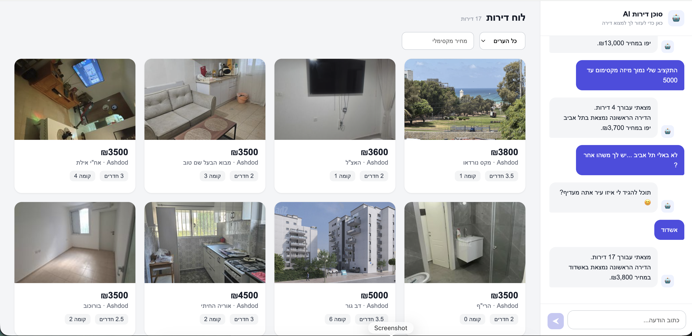

# AI Real Apartment Agent

AI-powered apartment search application built with **React**, **Node.js**, and **Google Gemini**.



---

# Project Overview

This project demonstrates a small Node.js REST API that retrieves apartment listings from a public data source (Yad2 via Apify), processes the data, and exposes clean REST endpoints for a React frontend.

The apartment data is stored locally in a JSON file, allowing the frontend to provide fast searches without repeatedly calling the external API.

---

# AI Feature

## AI Apartment Search Agent

Instead of manually selecting filters like on Yad2, users simply describe the apartment they are looking for in natural Hebrew.

### Why this AI feature?

I chose this feature because searching for an apartment is naturally conversational.

Instead of manually selecting filters, users can simply describe what they are looking for in natural language. The AI understands the request, extracts the relevant search criteria, and returns the most suitable apartments, creating a faster and more intuitive search experience.

Examples:

- "מצא לי דירת 4 חדרים בתל אביב עד 10,000 ש״ח"
- "אני מחפש דירה להשכרה באשדוד עם חניה"
- "תראה לי דירות להשכרה בתל אביב עם מעלית"

The AI agent uses **Google Gemini Function Calling** to:

- Understand the user's request
- Extract the search filters
- Search the apartment database
- Return matching apartments directly inside the chat interface

This creates a much more natural apartment search experience compared to manually filling multiple filter fields.

---

# Apartment Data

Apartment listings were retrieved using the **Apify Yad2 API**.

For this project, the retrieved data is stored locally in:

```
server/apartments.json
```

The current dataset contains apartment listings from:

- Tel Aviv
- Ashdod

and **rental apartments only**.

> **Note:**  
> When testing the application, searches should be limited to rental apartments in **Tel Aviv** or **Ashdod**, since those are the only listings currently stored in the local dataset.

Examples:

- "מצא לי דירה להשכרה בתל אביב עד 8,000 ש״ח"
- "אני מחפש דירת 4 חדרים באשדוד"
- "תראה לי דירות להשכרה באשדוד עם חניה"

---

# Getting Started

## Clone the repository

```bash
git clone <repository-url>
```

---

## Install dependencies

Backend

```bash
cd server
npm install
```

Frontend

```bash
cd client
npm install
```

---

## Create a `/server/.env` file

Inside the **server** folder:

```env
GEMINI_API_KEY=YOUR_GEMINI_API_KEY
APIFY_TOKEN=YOUR_APIFY_TOKEN
```

---

## Start the backend

```bash
cd server
npm run dev
```

---

## Start the frontend

```bash
cd client
npm run dev
```

---

# Tech Stack

### Frontend

- React
- Vite

### Backend

- Node.js
- Express

### AI

- Google Gemini 2.5 Flash
- Function Calling

### Data Source

- Apify Yad2 Scraper API

---

# Future Improvements

With more time I would:

- Automatically refresh apartment data twice a day. (using updateData.js script)
- Add a detailed apartment popup when card is clicked by the user.
- Open the original Yad2 listing.
- Generate AI videos from apartment photos.
- Add an interactive map for apartment search.
- Save recent searches and chat history.
- Add unit and integration tests.